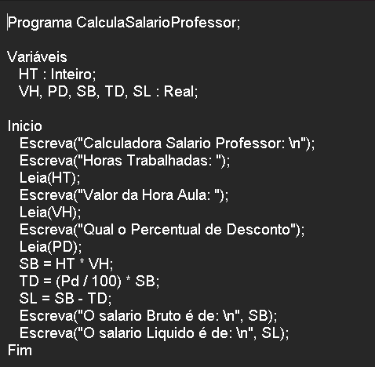

# CalculadoraSalarioProfessor

**Calculadora de Salario De Professor Em LPP | Português Estruturado | Portugol | Potigol | Metalinguagem | Pseudocódigo**  

## Enunciado

**Desenvolver um programa que calcule o salário liquido de um professor.** 

   

Autor: Erick Leite Freire 
Criado em: 30-10-2023 
Site: [Escola do Autodidata](https://www.escoladoautodidata.com.br) 
